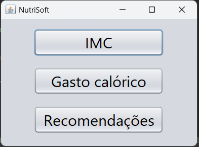
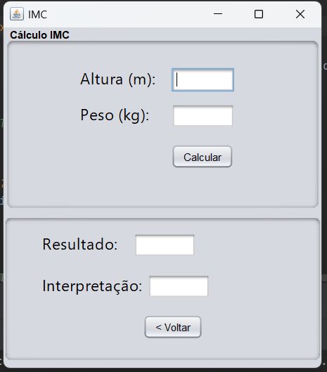
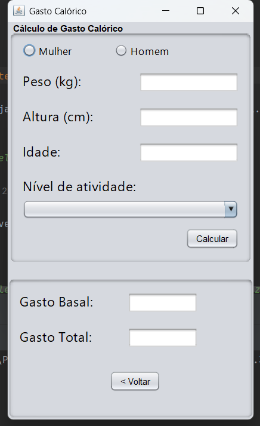
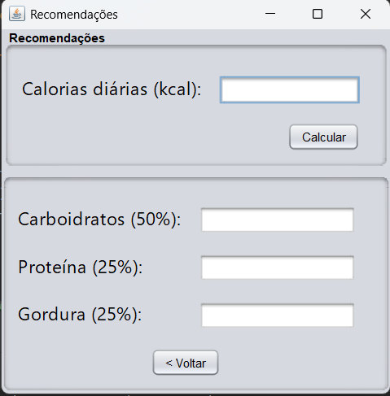

# NutriSoft 🥗

Sistema desktop desenvolvido em Java, com intuito de ajudar nutricionistas em suas consultas.

## Preview do sistema 🔍

## Sobre o projeto 📄
O NutriSoft foi desenvolvido como projeto acadêmico do curso de Análise e Desenvolvimento de Sistemas do SENAC RS.

O objetivo do sistema é auxiliar nutricionistas em suas consultas com cálculos de IMC, taxa metbólica basal, calorias diárias e recomedações nutricionais.

## Funcionalidades 🛠️

- Cálculo de IMC
- Cálculo de calorias diárias
- Ajuda de recomendações de Carboidratos, Calorias e Gorduras
- Interface gráfica em Java Swing
- Validação de campos e exceção de regras
- Conversão automática de valores numéricos

## Tecnologias utilizadas 🔧
- Java  25.0.2
- Java Swing
- NetBeans (para interfaces gráficas)
- Intellij (para lógica de botões e validações)

## Como executar ▶️

1. Clone o repositório
2. Abra o projeto no Netbeans ou Intellij (ou qualquer IDE que consiga rodar o programa em Java)
3. Execute o frame "TelaInicial.java" dentro da pasta "src".

## Aprendizados 🧑‍🏫

Durante o desenvolvimento deste projeto aprendi:
- Organização do projeto antes de começar o código
- Organização de Classes e JFrames no projeto
- Manipulação de enventos em Java Swing
- Validação e exceções
- Boas práticas de programação

## Autor 👨🏽‍💻

Guilherme Silva

LinkedIn:
[linkedin.com/in/guilhermesilva](https://www.linkedin.com/in/guilherme-silva-a6796327a/)

GitHub:
[github.com/Guilherme-Silva-dos-Santos](https://github.com/Guilherme-Silva-dos-Santos)

